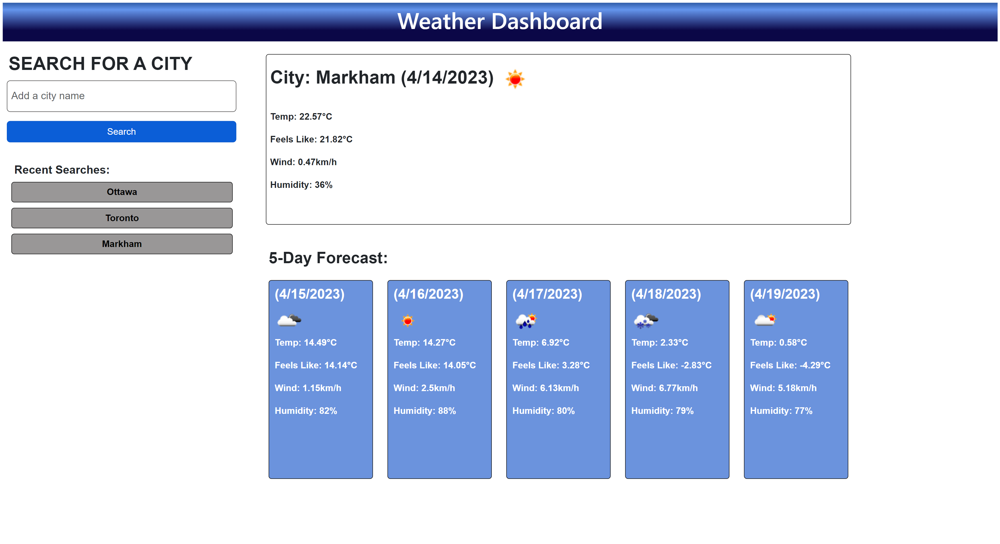

# Weather Dashboard

This is a Weather Dashboard website allows users to check the current weather conditions of any city in the world, as well as a 5-day forecast.

## This project was built using the following technologies:

- HTML
- CSS
- JavaScript
- OpenWeatherMap API
- Bootstrap

## Usage
To use the website, simply go to the web browser and enter the URL.
You can search for the weather conditions of any city by entering the name of the city in the search bar and clicking on the "Search" button. The website will display the current weather conditions of the city, as well as a 5-day forecast. 
The website will also save the last cities searched by the user, and display them bellow the search imput field. The user can click on any of the cities in the "Recent Searches" section to display the weather conditions of that city.

## API 
When you add the city name the API will first retrive the data using the coordinates of the input, and after that, it will retrive the data using the city name. Searching by coordinates allows you to get weather information for any location on the planet,

## License
This project is licensed under the MIT License.

# Screenshot and link for the deployed application

[Link deployed application](https://elisamarchete.github.io/weather-dashboard/)

